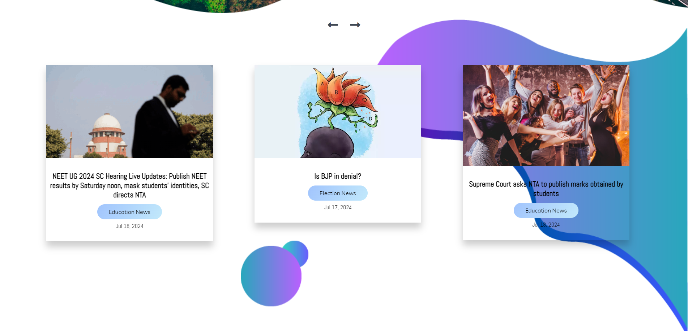

# Website (News or Blog)


# News Page


# Link Dynamically with:-




## Description

This repository contains the source code for a clone of a News or Blog website. The purpose of this project is to replicate the design and functionality of the original site using HTML, CSS, and JavaScript. This project is part of my web development learning journey, and it demonstrates my skills in front-end development.

## Features

- **Responsive Design**: Ensures optimal viewing experience across various devices (desktops, tablets, and mobile phones).
- **Navigation**: Includes a fully functional navigation bar that adapts to different screen sizes.
- **Home Page**: Mimics the look and feel of the original site's home page.
- **Article Pages**: Replicates the design and layout of individual article pages.
- **Interactive Elements**: Adds interactive features such as sliders, modals, and animations.

## Technologies Used

- **HTML5**: For structuring the content.
- **CSS3**: For styling and layout.
- **JavaScript**: For adding interactive elements and functionality.
- **PHP**: For adding Dynamic project view.
- **[Any frameworks or libraries used, e.g., Bootstrap, jQuery]**

## Installation

1. Clone the repository:
   ```bash
   git clone https://github.com/EshaanManchanda/Website-clone-News-or-Blog-.git

## Technology I used

1. Xampp( For PHP )
2. Vscode( code editor)

Feel free to customize this template to better fit your project and personal preferences.
